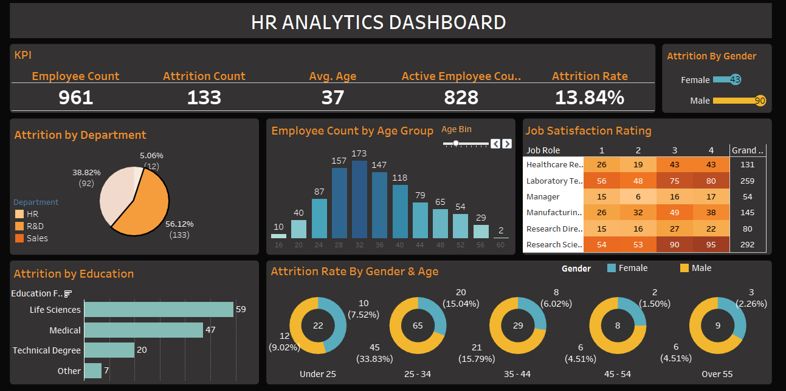

# HR Analytics Dashboard – Tableau

## Project Overview
This project presents an interactive Tableau dashboard designed to analyze employee attrition and workforce demographics. The dashboard helps identify key attrition drivers and employee trends to support data-driven HR decision-making.

## Key Metrics
- Employee Count  
- Active Employees  
- Attrition Count  
- Attrition Rate  
- Average Age  

## Dashboard Insights
- Attrition varies significantly across departments, with Sales contributing the highest share  
- Higher attrition is observed in specific age groups, particularly early-career employees  
- Gender-based analysis highlights differences in attrition patterns across age bands  
- Job satisfaction levels vary by role and may influence attrition behavior

## Dashboard Preview

## Visual Analysis Included
- Attrition by Department  
- Employee Distribution by Age Group  
- Attrition by Gender and Age  
- Job Satisfaction Rating by Role  
- Attrition by Education Level  

## Tools & Skills Used
- Tableau  
- Data Visualization  
- Exploratory Data Analysis (EDA)  
- HR Analytics  

## Use Case
This dashboard can assist HR teams in identifying retention risks, optimizing workforce planning, and improving employee engagement strategies.
